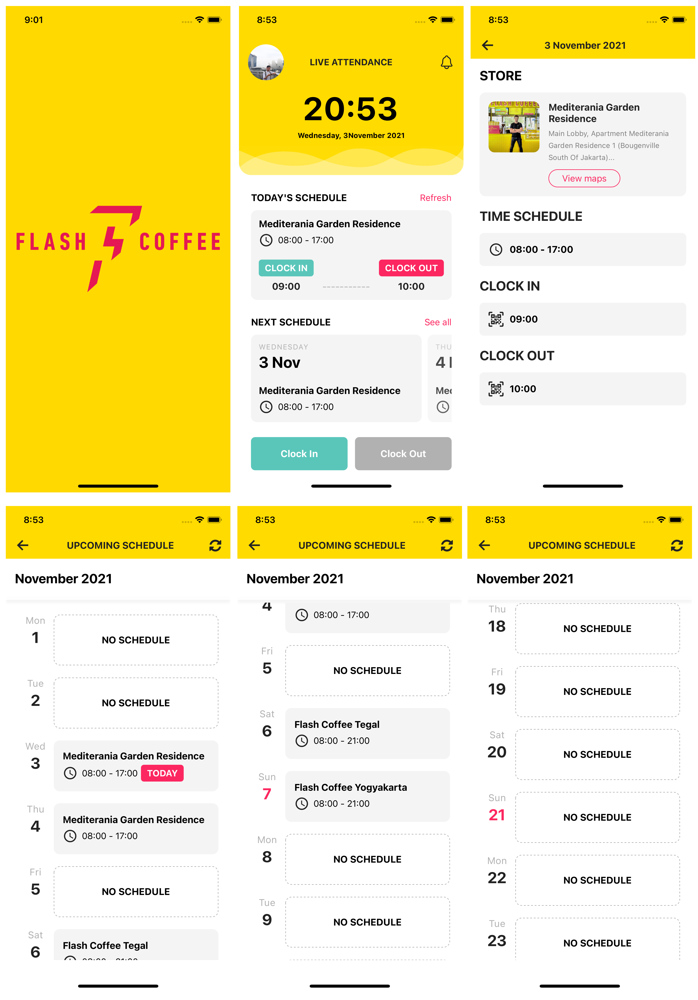

# Flash Coffee

## Getting Started
### 1. Clone this repo
```
$ git clone https://github.com/hidayatNgganteng/flashCoffee.git
```
### 2. Install & Setup
```
$ cd flashCoffee

$ npm install
```
### 3. Run Project
```
# ios
$ react-native run-ios

# android
$ react-native run-android
```
## Features
#### 1. HomeScreen
#### 2. Upcoming Schedules
#### 3. Details Schedule

## Screenshoot

